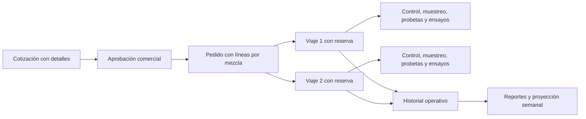

# Preparación del backend de HormiGestión

Fecha: 3 de octubre de 2026. Estado: plan general de referencia, con incrementos posteriores de base/cotización y reportería. El inventario vigente está en [ESTADO_DEL_PROYECTO.md](ESTADO_DEL_PROYECTO.md); los supuestos editables, en [datos demo](05-datos-demo-y-primer-incremento.md).

> Las entidades, rutas y etapas propuestas aquí no equivalen a operaciones ya disponibles. Contrastar con el inventario y con `/api/v1/openapi.json` antes de implementar o integrar. Las conclusiones de la auditoría se refieren al diseño original.

## 1. Base de alcance

Se toma como referencia el acta indicada por el usuario. El backend debe sostener catálogo institucional, cotización pública con registro 24/7, programación de despachos, trazabilidad de calidad y proyección automática de demanda. Las diferencias del diseño están en [la auditoría](01-auditoria-alineacion.md).

La [investigación de hormigoneras](03-operacion-hormigon-y-ajustes.md) aporta evidencia y reglas OP-01–OP-12. Este plan incorpora confirmación de programación, ciclo completo del mixer, recepción por viaje y separación entre muestra, probeta y ensayo. Las políticas de otras empresas no se adoptan como condiciones propias.

No forman parte de esta propuesta SRI/facturación electrónica, pagos en línea, contabilidad/nómina, GPS en vivo, app nativa ni chatbot. La automatización de tareas del equipo con n8n es una herramienta de gestión del proyecto, distinta de los módulos de la empresa.

Los identificadores `BE-xx` de este archivo son etiquetas locales de preparación, no sustituyen ni inventan el catálogo RF original.

## 2. Decisiones que pueden fijarse técnicamente

| Decisión propuesta | Base y propósito |
| --- | --- |
| API REST y monolito modular con dominio, aplicación e infraestructura | Arquitectura E p. 1-5; estructura común para reglas y persistencia |
| Node.js 24 LTS y TypeScript | Node.js está definido en el acta; TypeScript concuerda con el frontend y el build contemplado en infraestructura. v24 figura LTS al 03/10/2026; v20 del ejemplo figura EOL. [Node.js](https://nodejs.org/en/about/previous-releases) |
| Express 5 como opción inicial | El diseño permite Express o Fastify; se propone Express para concretar un adaptador HTTP. Su API es compatible con una línea Node.js 24. [Express 5](https://expressjs.com/en/api/) |
| PostgreSQL 16 y repositorios SQL parametrizados | E p. 4, 19; compatible con el modelo que pide PostgreSQL 14+ |
| Un gestor de paquetes y un lockfile en backend | Reproducir instalación y build; propuesta inicial npm por los Dockerfiles del diseño |
| JWT y hash bcrypt como adaptadores | E p. 4, 44-52; validar firma/expiración e identidad activa, además de rol |
| Fechas persistidas como `TIMESTAMPTZ`; presentación en `America/Guayaquil` | Recuperar eventos y agrupar por horario operativo de Ecuador |
| Importes decimales; respuesta con representación decimal consistente | Evitar que cálculos monetarios y PDF difieran por punto flotante |
| Docker Compose para entorno local; configuración productiva separada | Desarrollo reproducible sin copiar las contradicciones del Compose del PDF |
| n8n para orquestación y notificaciones | Acta A p. 4; reglas y eventos críticos persistidos en backend |

El primer incremento usa Node.js 24, TypeScript, Express 5, PostgreSQL 16, npm/lockfile, JWT/bcrypt y Compose local. Las dependencias están en `package.json` y `package-lock.json`. También se instalaron [skills de asistencia](04-skills-instaladas.md); no son dependencias de aplicación. Producción, proveedores y costos siguen pendientes.

## 3. Decisiones de negocio pendientes

El usuario autoriza avanzar con supuestos ficticios plausibles y parámetros editables. Los valores están en [la configuración demo](05-datos-demo-y-primer-incremento.md); no bloquean el desarrollo. Esta tabla conserva decisiones por validar para reemplazar la demostración por operación real.

| ID | Decisión | Propuesta para revisión | Responsable funcional sugerido |
| --- | --- | --- | --- |
| D01 | Alcance actual frente a informe previo de dos implantaciones | Mantener los cinco módulos del acta en el proyecto actual; registrar cualquier cambio aprobado | Gestor y propietario |
| D02 | Inicio y final del plazo de 90 min; límite exacto y excepciones | Origen real de carga/contacto agua-cemento según acta, fin de descarga y versión de política; alerta temporal separada de dictamen técnico; verificar edición/cláusulas normativas | Planta/despachador y responsable técnico de calidad |
| D03 | Capacidad por vehículo y posible techo global de 8 m³ | Usar capacidad del mixer; aplicar techo de 8 solo si se confirma como regla global | Planta/despachador |
| D04 | Flete por zona, km, m³ o viaje | Priorizar la regla comercial real y documentar tres ejemplos; no adoptar por defecto los valores del mockup | Propietario |
| D05 | Desperdicio, redondeo y geometrías | Catálogo de valores sugeridos y rango validado; confirmar cálculo de losas alivianadas y volumen directo | Propietario/planta |
| D06 | Lista de precios, vigencia, IVA y bombeo | Tarifas configurables con vigencia; desglose y copia de condiciones en cada cotización | Propietario |
| D07 | Códigos de roles, acceso de cliente y responsable de calidad | Visitante público; unificar administrador, despacho y conductor; completar permiso de calidad | Propietario y gestor |
| D08 | Permiso del administrador para actualizar tránsito | Resolver contradicción entre matriz y casos de uso; no asumir acceso total para todas las acciones | Planta y propietario |
| D09 | Agenda, duración, retorno, lavado y turnos | Reservar mixer/conductor hasta disponibilidad; capacidad de planta, cadencia de suministro y confirmación de bombeo cuando aplique | Despachador |
| D10 | Kanban, cambios, cancelación, recepción y cierre | Tablero como resumen de pedido/viajes; revisiones autorizadas, entrega parcial, rechazado/retornado y faltante; cierre físico distinto del dossier | Propietario/planta |
| D11 | Muestreo, edades, probetas, criterio y corrección | Plan de muestreo, probetas distintas para 7/28, una rotura por pieza; agrupación por muestra/edad, norma/versionado y revisión profesional | Responsable de calidad |
| D12 | Pronóstico: historial, horizonte, mínimo de datos, métrica y alerta | Proyección semanal por resistencia/zona/franja; definir demanda total frente a adicional; insuficiencia de datos y recomendaciones sin producción automática | Propietario y responsable de datos |
| D13 | Notificación interna: canal, destinatarios y horario | Solicitud persistida primero; evento con reintentos y horario operativo configurado | Propietario/despachador |
| D14 | Sede y área real de servicio | Confirmar ubicación y zonas; separar datos ficticios Quito/Tungurahua de catálogo productivo | Propietario |
| D15 | Alojamiento y disponibilidad | Verificar costo dentro de USD 120/año; medir disponibilidad pública y productiva por separado | Gestor/backend y propietario |

Guardar cada acuerdo con fecha, fuente, regla, ejemplos y criterio de aceptación. No sustituir respuestas comerciales por una elección técnica silenciosa.

## 4. Módulos y casos de uso mínimos

| ID | Módulo | Casos de uso | Datos principales | Evidencia de terminación |
| --- | --- | --- | --- | --- |
| BE-01 | Identidad y acceso | Autenticar, obtener identidad, crear/editar/desactivar personal, verificar rol y propiedad de recurso | roles, usuarios, vínculo conductor | Usuario inactivo denegado; conductor accede solo a viajes propios |
| BE-02 | Catálogos | Consultar resistencias, elementos, zonas y servicios; administrar tarifas/configuración y especificaciones de mezcla | Catálogos actuales, mezclas/versiones y reglas comerciales | Cinco resistencias del acta; especificación técnica separada del precio |
| BE-03 | Cotización y solicitudes | Calcular, registrar solicitud, obtener comprobante y PDF, contactar/aprobar/rechazar/vencer | clientes, cotizaciones, detalles, desglose histórico | Precio reproducible; vigencia; solicitud persistida y evento de notificación |
| BE-04 | Pedidos y flota | Convertir aprobación en pedido, registrar obra, confirmar agenda, dividir viajes, reservar y revisar programación | pedidos, líneas, obra, flota, reservas y revisiones | Sin cruces ni exceso por mezcla; capacidad de planta y ciclo del mixer considerados |
| BE-05 | Despacho y tiempo | Registrar carga, salida, arribo, recepción, descarga, retorno/disponibilidad e incidencias | despachos, marcas, recepciones, balance y eventos | Timer persiste; evidencia por viaje; volumen parcial/retornado y faltantes consistentes |
| BE-06 | Calidad | Registrar lote/control y ajustes; planificar muestreos/probetas/roturas; resultados, revisión y dossier | lotes, controles, muestreos, probetas, ensayos e informes | Una rotura por probeta; pendientes 7/28 y correcciones visibles; unidad y criterio explícitos |
| BE-07 | Reportes y proyección | Indicadores reales, importar historial, ejecutar análisis semanal, guardar recomendaciones/evaluación | historial, ejecuciones y resultados analíticos | Se distinguen observaciones y pronósticos; alerta semanal y contraste con datos reales |
| BE-08 | Operación e integración | Salud, migraciones, eventos/notificaciones, logs, respaldo y recuperación | eventos persistidos, esquema y configuración | Entorno reproducible; fallo de n8n no pierde solicitudes; restauración probada |

## 5. Modelo de datos: cambios antes de las migraciones

Reutilizar el DDL como insumo, manteniendo sus 16 tablas cuando su finalidad siga vigente. No ejecutarlo automáticamente. Revisar los siguientes cambios y convertirlos en migraciones incrementales:

1. **Identidad:** vínculo explícito y único entre cuenta autenticada y conductor; códigos de rol canónicos; permisos de calidad. Resolver si basta rol fijo o hace falta una matriz configurable. No añadir tablas de permisos sin necesidad demostrada.
2. **Cotización:** distinguir cálculo previo de solicitud confirmada; contacto y canales necesarios; tipo/monto de bombeo; tasa/monto de impuesto; neto, desperdicio, flete y total; copia de condiciones vigentes. Los precios unitarios actuales de detalle ya son una base de fotografía histórica y deben preservarse.
3. **Líneas de pedido:** conservar mezcla/especificación y volumen aprobados por línea; relacionar viajes con esas líneas. Obra, contacto receptor y requisitos de entrega; revisiones aprobadas de volumen/fecha. Controlar programado y aceptado; conservar destinos físicos, rechazo y pendiente sin doble conteo.
4. **Programación:** reserva por despacho con inicio/fin planificados para mixer y conductor, hasta retorno/disponibilidad. Proteger solapamientos de forma atómica; validar carga de planta, horarios y cadencia; considerar bombeo propio o confirmado por proveedor. Cancelación libera la reserva conservando historial.
5. **Marcas reales:** carga inicialmente nula en viajes programados; persistir eventos al ocurrir. Secuencia temporal validada según estado; correcciones con motivo y responsable. No confundir fecha estimada con fecha real.
6. **Capacidad:** validar volumen contra vehículo y techo confirmado. Evitar cambios de capacidad que invaliden reservas sin revisión. Aplicar protección en aplicación y una defensa de datos apropiada, no confiar en una FK.
7. **Calidad:** consistencia de lote/mezcla entre despacho y control; especificación/versionado con unidades y objetivos. Dictamen pendiente distinto de aprobado; ajustes de agua/aditivo como eventos con responsable y autorización. No deducir conformidad solo del tiempo, slump o porcentaje de resistencia.
8. **Ensayos:** separar muestreo, probeta individual y rotura. Una muestra puede tener varias probetas por edad; cada probeta tiene como máximo una rotura física. Programación pendiente con resultados nulos; fecha/hora de moldeo, curado y edad real; informe por muestra/edad con criterio y revisión. Una corrección conserva el original y no crea una segunda rotura. No introducir datos ficticios para satisfacer `NOT NULL`.
9. **Auditoría:** historial de transiciones y cambios sensibles con usuario, fecha, valores relevantes y motivo; conservar responsable tras desactivar usuarios. Revisar borrados en cascada y `SET NULL` que eliminan trazabilidad.
10. **Eventos:** bandeja persistente de eventos a notificar, con identificador, tipo, fecha, intentos y estado de entrega. Puede implementarse como patrón outbox para persistir solicitud y evento juntos. Es una extensión técnica propuesta para tolerar fallos, no una tabla ya existente.
11. **Analítica:** ejecuciones de proyección y resultados con período histórico, fecha de corte, versión de método, horizonte, resistencia/zona/franja, volumen previsto, recomendación y evaluación. Definir almacenamiento a partir de D12; no inventar porcentajes de precisión.
12. **Restricciones:** volúmenes positivos, desperdicio dentro del rango acordado también en detalle, importes no negativos, marcas coherentes y estados no nulos donde sean obligatorios. Comparar sumas de viajes en transacciones.
13. **Recepción y balance:** comprobante operativo único por viaje; cantidad descargada, aceptada, observada/rechazada y retornada con motivo/receptor. Balance físico separado de recepción comercial; sustituciones vinculadas a faltantes. No liberar automáticamente el mixer al finalizar la descarga.
14. **Políticas versionadas:** plazo de entrega, umbrales y condiciones aplicables copiados al pedido/viaje. Una actualización de catálogo no cambia límites o especificaciones de una entrega en curso.

Mantener separadas migraciones de estructura, catálogos aprobados y semillas de demostración. Los reinicios no deben borrar datos ni crear duplicados. Documentar la actualización de una base existente: los scripts `initdb` solo actúan en la creación inicial del volumen.

## 6. Flujos y reglas comunes propuestas

### Cotización pública

1. Consultar catálogos y recibir dimensiones o volumen directo, elementos, resistencia, zona y servicios.
2. Validar en servidor, calcular con reglas configuradas y devolver desglose. Las cantidades/precios enviados por el cliente no se aceptan como total definitivo.
3. Registrar la solicitud confirmada con contacto y fecha preferida; guardar detalles y evento de notificación en una transacción.
4. Devolver identificador, código único, vigencia real y acceso a PDF basado en los mismos datos. Generar códigos de forma segura ante concurrencia.
5. Personal autorizado contacta y aprueba/rechaza. Crear pedido de una aprobación vigente de manera idempotente.

La fecha preferida del cliente no es una reserva garantizada de mixer. La API debe expresar esa diferencia.

La revisión de despacho completa obra/contacto receptor, acceso, horario, especificación de mezcla, ritmo de entrega y bombeo. Una solicitud pública breve puede completarse internamente antes de confirmar; no obliga a llenar una ficha técnica extensa para obtener una primera cotización.

### Cotización, pedido y viaje



Mantener estados comerciales y operativos separados. Como punto de partida se pueden conservar los enums del SQL, después de revisar transiciones. El Kanban debe consultar un resumen derivado, con visibilidad de viajes hijos y excepciones.

Con el vocabulario SQL, el recorrido típico propuesto del viaje es `PROGRAMADO -> EN_CARGA -> EN_RUTA -> EN_OBRA -> DESCARGADO`. Definir cuándo puede registrarse `RECHAZADO` y qué significa cancelar antes de cargar, que no tiene estado propio en el enum actual. No permitir modificar un estado arbitrariamente mediante un formulario genérico.

Precisar `EN_DESCARGA` y cancelación antes de carga en la revisión de estados. Rechazo puede ser parcial: no debe ocultar la cantidad aceptada. Mantener recepción, incidencia, disponibilidad de recurso y cierre de calidad separados del estado de tránsito. El cambio de mezcla o volumen después de confirmar requiere revisión aprobada y control de viajes afectados.

### Cronómetro

Propuesta pendiente de D02: `transcurrido = hora_servidor - hora_origen`, o `hora_fin_descarga - hora_origen` si terminó. `hora_origen` registra el contacto inicial agua-cemento/carga acordado y es distinto de fin de carga y salida. Antes del evento real, el reloj está pendiente, no en cero con un inicio ficticio.

| Tiempo transcurrido | Indicador propuesto |
| --- | --- |
| Menos de 60 min | Normal |
| Desde 60 y menos de 80 min | Advertencia |
| Desde 80 hasta 90 min inclusive | Crítico |
| Mayor de 90 min | Plazo excedido; incidencia y decisión operativa registrada |

Confirmar el comportamiento exacto a los 90 minutos. Conservar tiempo excedido y permitir documentar el evento real: impedir su registro destruiría evidencia. El indicador temporal no sustituye evaluación técnica de calidad.

Los 90 minutos se mantienen por el acta como política del proyecto; no se interpreta el exceso como pérdida física universal ni se cambia automáticamente a `RECHAZADO`. La [evidencia técnica y la limitación de verificación INEN](03-operacion-hormigon-y-ajustes.md) quedan documentadas. Guardar política/versión en el viaje; una adición de agua o un cambio de catálogo no reinician su reloj.

La respuesta del monitor incluye hora del servidor, origen, plazo límite, marcas y estado. El navegador puede animar el reloj entre consultas; no decide el origen ni recupera estado de un contador local. Recuperar alertas pendientes tras reinicios y evitar duplicarlas por viaje/umbral.

### Proyección

Importar el historial de cuadernos comprometido en A p. 7 con revisión de calidad y procedencia. Distinguir demanda solicitada, aprobada y volumen efectivamente despachado; no sumarlos indiscriminadamente. Separar datos de ejemplo de registros reales y evitar duplicar filas al reimportar.

n8n programa la ejecución semanal, invoca un caso de uso/servicio autorizado y distribuye la alerta interna. Persistir método, datos de corte y recomendaciones por resistencia, zona y horario. Incluir sugerencias de volumen y flota según el acta, sin convertir la recomendación en una reserva automática.

El objetivo del pronóstico debe indicar si estima demanda total o adicional a pedidos confirmados; no sumar ambos sin definición. Planificar recursos y capacidad para fabricar cuando corresponda, sin ordenar cargas frescas para almacenar por una previsión. Entrenar/evaluar por fecha de corte, evitando datos futuros en el entrenamiento.

Si faltan datos, devolver un estado explícito de historial insuficiente. Una línea base estadística puede servir para desarrollar y evaluar el flujo, pero no acredita por sí sola el compromiso de series temporales/regresión. Seleccionar y validar el método con el historial disponible; contrastar mensualmente previsión y despacho real. El acta no fija un umbral numérico exacto de error: definirlo con el propietario.

## 7. Propuesta de API para integración

Plan completo de rutas bajo `/api/v1`. Acceso, catálogos/configuración y cotización ya tienen implementación. El contrato servido por `/api/v1/openapi.json` y [el estado del incremento](05-datos-demo-y-primer-incremento.md) identifican rutas existentes; logística, calidad y proyección de esta tabla siguen siendo propuestas. Acordar cómo Nginx conserva o transforma el prefijo.

| Grupo | Operaciones propuestas | Acceso |
| --- | --- | --- |
| Salud | `GET /health/live`, `GET /health/ready` | Respuesta mínima sin credenciales/datos internos; readiness comprueba dependencias necesarias |
| Catálogos | `GET /api/v1/catalogos/resistencias`, `/elementos`, `/zonas-flete`, `/servicios` | Público para datos comerciales publicados |
| Cálculo | `POST /api/v1/cotizaciones/calcular` | Público, validado y con límites de solicitud |
| Solicitud | `POST /api/v1/cotizaciones` | Público; crea solicitud con datos mínimos acordados |
| Comprobante | `GET /api/v1/cotizaciones/:id/comprobante`, `/:id/pdf` | Capacidad privada limitada al comprobante propio o usuario autorizado |
| Sesión | `POST /api/v1/auth/login`, `GET /api/v1/auth/me` | Login público; identidad autenticada |
| Personal | `GET/POST /api/v1/usuarios`, `PATCH /api/v1/usuarios/:id` | Administrador según matriz consolidada |
| Comercial | `GET /api/v1/cotizaciones`, `POST /api/v1/cotizaciones/:id/aprobar`, `/:id/rechazar` | Personal comercial/despacho autorizado |
| Pedido | `POST /api/v1/pedidos`, `GET /api/v1/pedidos/:id`, `POST /api/v1/pedidos/:id/despachos`, `/:id/revisiones`, `/:id/confirmar-programacion` | Personal autorizado; creación idempotente, control de líneas y confirmación de recursos |
| Flota y agenda | `GET /api/v1/mixers`, `/conductores`, `/disponibilidad`; operaciones de administración/reprogramación por definir | Lectura/asignación por despacho; administración según matriz |
| Eventos del viaje | `POST /api/v1/despachos/:id/carga`, `/salida`, `/arribo`, `/inicio-descarga`, `/descarga`, `/retorno`, `/disponibilidad`, `/incidencias` | Rol autorizado y, para conductor, recurso propio y acción permitida |
| Recepción | `POST /api/v1/despachos/:id/recepcion`, `GET /api/v1/despachos/:id/comprobante` | Personal autorizado; receptor/evidencia y balances; compartir comprobante con alcance limitado |
| Monitor | `GET /api/v1/despachos/activos`, `GET /api/v1/despachos/:id`, `GET /api/v1/chofer/me/despachos` | Despacho/admin; conductor solo propio |
| Calidad | `POST /api/v1/lotes`, `POST /api/v1/despachos/:id/controles-calidad`, `POST /api/v1/despachos/:id/ajustes-mezcla`, `POST /api/v1/controles-calidad/:id/muestreos`, `POST /api/v1/muestreos/:id/probetas`, `POST /api/v1/probetas/:id/ensayo`, `PATCH /api/v1/ensayos/:id/resultado` | Permisos de calidad por definir; una rotura por probeta, pendientes y correcciones auditadas |
| Revisión de calidad | `POST /api/v1/muestreos/:id/informes`, `POST /api/v1/informes-calidad/:id/revisiones` | Responsable técnico; criterio/versionado y resultados por edad, sin dictamen automático por un cilindro |
| Dossier | `GET /api/v1/despachos/:id/trazabilidad`, `/:id/trazabilidad/pdf` | Personal autorizado; compartir evidencia específica con cliente según política acordada |
| Reportes | `GET /api/v1/reportes/operacion` | Administrador/propietario según matriz |
| Proyección | `GET /api/v1/proyecciones`, `POST /api/v1/interno/proyecciones/ejecutar` | Consulta propietario; ejecución por identidad de servicio interna |
| Historial | Importación validada con vista previa y confirmación; ruta a definir con formato disponible | Responsable de datos autorizado |

El acceso público al cotizador no autoriza listar clientes ni consultar cotizaciones ajenas por código secuencial. Para el comprobante de visitante, proponer un token opaco limitado, recibido al crear la solicitud; UUID o código de cotización por sí solos no sustituyen autorización.

Definir DTOs y OpenAPI al implementar. Contratos comunes: errores con código/mensaje/campos inválidos, paginación y filtros para listas, fechas ISO 8601 con zona, unidades explícitas, decimales consistentes y códigos de estado de dominio separados de HTTP. Usar `401` para sesión inválida y `403` para falta de permiso; resolver también propiedad del recurso.

Los eventos críticos de viaje deben admitir reintentos seguros: repetir una carga/salida o doble clic no reinicia el plazo. Usar transacciones para aprobación/pedido, reservas y totales. Las automatizaciones necesitan identidad de servicio y entregas idempotentes; no reutilizar un usuario administrador ni credenciales de PostgreSQL.

## 8. Estructura propuesta

```text
hormigestion-backend/
  docs/
  src/
    domain/
      entities/
      rules/
      repositories/
    application/
      auth/
      catalogos/
      cotizaciones/
      pedidos/
      despachos/
      flota/
      calidad/
      reportes/
      proyecciones/
    infrastructure/
      database/migrations/
      repositories/
      http/controllers/
      http/routes/
      http/middlewares/
      services/
      jobs/
    app.ts
    server.ts
  tests/
    domain/
    integration/
  Dockerfile
  compose.yaml
  .env.example
  package.json
  package-lock.json
  tsconfig.json
```

Ya existen servidor, dominio, servicios, repositorios PostgreSQL, migración, semilla demo, tests y Docker. Este árbol orienta la evolución; los módulos futuros no se presentan como funcionalidad terminada.

El dominio no importa Express, SQL, JWT, PDF ni n8n. Los casos de uso dependen de puertos y reciben reloj/servicios como dependencias. Infraestructura implementa persistencia y adapta HTTP; el arranque conecta las dependencias. Una implementación modular facilita añadir calidad y proyección al árbol incompleto del PDF.

## 9. Secuencia de implementación y aceptación

| Etapa | Resultado concreto | Dependencias | Verificación significativa |
| --- | --- | --- | --- |
| 0. Consolidación | Registro de decisiones D01-D15 y trazabilidad acta/casos | Propietario y planta para reglas afectadas | Ejemplos comunes de flete, desperdicio, capacidad y cronómetro sin contradicciones |
| 1. Base técnica | TypeScript/Express, configuración validada, errores, logs y endpoints de salud; PostgreSQL/Compose local | Elecciones técnicas propuestas | Build y arranque; readiness falla sin DB; sin secretos en respuesta ni archivos versionados |
| 2. Datos y acceso | Migraciones incrementales, catálogos de referencia, usuarios con hash y matriz de permisos | D07-D08; modelo de identidad | Migrar base vacía; reiniciar sin perder datos; negar identidad inválida/inactiva y acceso ajeno |
| 3. Cotización | Cálculo, registro, PDF, vigencia, aprobación y evento de solicitud | D04-D06, D13-D14 | Casos numéricos acordados; rechazar importes manipulados; PDF coincide con registro; fallo de n8n conserva solicitud |
| 4. Logística | Pedido por líneas, reservas, viajes parciales, transiciones y monitor | D02-D03, D09-D10 | Concurrencia de reservas; límite real de mixer; evitar volumen duplicado; timer persiste ante reinicio |
| 5. Calidad | Lotes, controles, muestreos, probetas, pendientes 7/28 e informes/dossier | D07, D11; etapa 4 | Una rotura por pieza; resultados pendientes y unidades explícitas; vínculo lote/mezcla y correcciones auditables |
| 6. Reportes/proyección | Historial real, consultas, ejecución semanal, panel/alerta y evaluación | D12; datos de etapas 3-5 | No duplicar imports; sin datos devuelve insuficiencia; repetir ejecución no duplica alerta; previsión distinguida de observación |
| 7. Integración/entrega | Frontend con API y permisos reales, flujos n8n, entorno productivo y manual | Etapas anteriores y D15 | Pruebas de aceptación del acta, mediciones, restauración en base aislada y entrega de credenciales/capacitación |

La base técnica puede comenzar mientras se consolidan reglas. Calidad y proyección siguen formando parte de la entrega del acta; ubicarlas después de logística establece dependencias, no una exclusión de alcance. El calendario debe planificarse con el gestor: esta tabla no promete una duración ni modifica el cierre del 04/12/2026.

### Casos que la suite debe verificar

- Cálculos con dimensiones, volumen directo, múltiples elementos, rango de desperdicio y redondeos aprobados.
- Flete y bombeo configurados; cambio de tarifa posterior no altera una cotización ya emitida; vencimiento real y autorización de aprobación.
- Pedido de volumen mayor que un mixer dividido correctamente; límites por mezcla y viajes rechazados/entregas parciales.
- Conciliar destino físico y recepción sin contar dos veces rechazo/retorno; sustituciones vinculadas al faltante; cambio aprobado recalcula pendientes.
- Dos reservas simultáneas del mismo mixer o conductor: solo una incompatible puede confirmarse.
- Descarga terminada no libera un recurso que sigue en retorno/lavado; validar capacidad de planta y confirmación de bombeo.
- Eventos de carga/salida idempotentes; tiempos ordenados y diferencias carga/salida; umbrales exactos 60, 80, 90 y exceso, usando reloj controlado en pruebas.
- Cuenta inactiva, JWT alterado/vencido, rol insuficiente y conductor que intenta consultar/modificar viaje ajeno.
- Calidad sin ensayo realizado permanece pendiente; edades/programación correctas; corrección auditada; dossier muestra faltantes.
- Impedir una segunda rotura de la misma probeta; 7/28 usan piezas distintas; edad real desde moldeo; agrupación por muestra/edad y unidades coherentes.
- Evento persistido cuando falla n8n; reintento sin duplicar efecto; proyección reproducible con corte de datos e importación idempotente.
- Migraciones sobre base vacía y evolución de una existente; respaldo y restauración de datos/flujos en un entorno de prueba.

### Medidas de aceptación del acta

| Indicador | Método propuesto |
| --- | --- |
| Cotización en menos de 3 minutos | Cronometrar flujo completo en la muestra de 20 cotizaciones indicada por el acta, con condiciones documentadas |
| Al menos 10 solicitudes en primer mes | Consulta de solicitudes reales confirmadas desde puesta en producción; excluir seeds/pruebas |
| Sin cruces de programación | Revisar reservas confirmadas y conflictos por mixer/conductor; validar prueba concurrente |
| Trazabilidad del 100% | Medir cobertura de lote/carga/resistencia/control y seguimiento de ensayos; pendientes de edad no se computan como resultados realizados |
| Proyección semanal y contraste mensual | Evidencia de ejecución, recomendaciones, alerta y comparación con despacho real; criterio de error acordado |
| Latencia citada menor a 1,2 s | Definir operaciones y percentil, luego medir bajo la concurrencia acordada; es distinto del tiempo humano de cotización |
| Disponibilidad citada 99,2% | Definir ventana y denominador; monitoreo público 24/7 y horario productivo, con cálculo correcto |
| Recuperación y entrega | Restauración ensayada, credenciales por roles definitivos, manual y capacitación de 4 h antes del cierre |

## 10. Primer incremento concreto recomendado

El primer incremento ya arranca con PostgreSQL, aplica migraciones no destructivas, autentica personal y publica catálogos. Permite editar parámetros con historial e incluye contrato de API, cálculo/registro con tarifas demo, idempotencia, comprobante/PDF y aprobación comercial. Su alcance y pruebas están en [el registro del incremento](05-datos-demo-y-primer-incremento.md).

Este incremento evita depender de datos simulados para obtener una base operativa. Su alcance sigue siendo un primer paso hacia los cinco módulos; no representa la entrega completa del proyecto.

Las skills instaladas y sus límites de uso están en [el registro de instalación](04-skills-instaladas.md). Ayudan a escribir y revisar la implementación; las reglas de la empresa, el acta y las pruebas de aceptación siguen siendo la referencia funcional.
