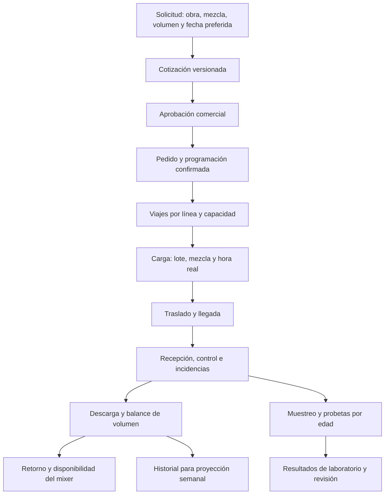

# Operación de hormigoneras y ajustes para HormiGestión

Investigación: 3 de octubre de 2026. Estado: referencia de dominio; la base técnica y cotización ya se implementaron con datos demo configurables. Complementa [la auditoría](01-auditoria-alineacion.md), [el plan general](02-preparacion-backend.md) y [el estado del incremento](05-datos-demo-y-primer-incremento.md).

> Las reglas operativas y estructuras propuestas sirven de diseño para módulos futuros. El [inventario vigente](ESTADO_DEL_PROYECTO.md) identifica cuáles tienen implementación y cuáles conservan solo parámetros preparados. Las condiciones de otras empresas no son condiciones confirmadas de Hormigonera Tungurahua.

## 1. Conclusión y criterio de uso

HormiGestión debe gestionar una cadena de solicitud, confirmación comercial, programación, cargas y entregas, seguida por controles y ensayos. El pedido y el viaje son entidades diferentes; la disponibilidad y la calidad requieren evidencia propia.

Se investigó hormigón **premezclado entregado fresco**, que corresponde al acta. Las políticas publicadas por otras empresas son ejemplos para contrastar el diseño; no constituyen acuerdos del propietario de HormiGestión. Las propuestas técnicas de las secciones 3-7 son inferencias para este proyecto y requieren resolver únicamente las decisiones funcionales afectadas.

Se mantienen los cinco módulos del acta y sus exclusiones. La investigación no incorpora facturación electrónica, pagos, GPS, contabilidad, inventario integral ni control automático de la dosificadora.

## 2. Evidencia de operación real

### Solicitud y confirmación

Holcim Ecuador valida la solicitud mediante programación y confirma según equipos y mixers disponibles. Publica condiciones particulares para cambios, volumen, cancelación con carga y permanencia en obra. Sus ejemplos de 48 horas para modificaciones y 45 minutos en obra son políticas comerciales de esa empresa, diferentes del límite de entrega del proyecto. [S01: condiciones de Holcim, sección Concreto](https://www.holcim.com.ec/terminos-y-condiciones).

Concretandes, otra empresa ecuatoriana, solicita ubicación, m³, resistencia, fecha y necesidad de bombeo. Ofrece coordinación de despacho y laboratorio, y recomienda anticipación para programar. Esto respalda recoger información operativa además de las dimensiones geométricas. [S02: operación y formulario de Concretandes](https://www.concretandes.com/).

### Especificación y ritmo de entrega

NRMCA explica que las mezclas responden a requisitos del proyecto y que la programación considera dirección, acceso, método de colocación, ritmo y duración. La resistencia por sí sola no describe todos los requisitos de entrega. El suministro es fresco y perecedero. [S03: CIP 31, edición con revisión 2023, pp. 1-2](https://www.nrmca.org/wp-content/uploads/2021/01/31pr.pdf).

### Plazo de entrega y decisión de calidad

La guía NRMCA de agosto de 2021 describe acuerdos sobre tiempo de descarga y revoluciones bajo ASTM C94/C94M; explica que un límite uniforme no representa todas las condiciones de mezcla y obra. Esto impide tratar los 90 minutos como una ley física universal. **Se conserva el límite del acta como política del proyecto**, sujeto a precisar su origen y fin; una alerta temporal no emite por sí sola un dictamen de calidad. [S04: Guide to Improving Specifications, página impresa 24, PDF p. 30](https://www.nrmca.org/wp-content/uploads/2020/10/GuideToSpecs.pdf).

### Ajustes en obra

NRMCA distingue las adiciones de agua o aditivo, sus límites acordados y el registro de cantidad y responsable en el comprobante de entrega. Para HormiGestión se propone una bitácora de ajustes que conserve la evidencia; no un cálculo automático que autorice modificar una mezcla. [S05: CIP 26, revisión 2023, pp. 1-2](https://www.nrmca.org/wp-content/uploads/2021/01/26pr.pdf).

### Muestras, probetas y ensayos

El ensayo de compresión rompe el cilindro. Los resultados de probetas de una misma muestra y edad se agrupan; curado estándar y curado en obra cumplen propósitos distintos. Un resultado temprano no equivale a rechazo por resistencia especificada a 28 días. La aceptación depende de la especificación y del conjunto de resultados, no de un booleano calculado para cada cilindro. [S06: CIP 35, revisión 2014, pp. 1-2](https://www.nrmca.org/wp-content/uploads/2021/01/35pr.pdf).

La preparación, el curado y el traslado de especímenes afectan la evidencia de ensayo. El backend debe conservar identidad y fechas para que el laboratorio pueda documentar ese recorrido. [S07: CIP 34, revisión 2014, pp. 1-2](https://www.nrmca.org/wp-content/uploads/2021/01/34pr.pdf).

### Situación de la referencia ecuatoriana

El Registro Oficial 856 del 06/10/2016, resolución 16 347, pp. 24-25, oficializa la primera revisión de NTE INEN 1855-1 y reemplaza la edición 2001. Esta evidencia histórica **no confirma la edición vigente en 2026 ni sus cláusulas completas**. No se pudo recuperar el texto oficial completo desde el portal INEN. Antes de codificar límites como requisitos normativos, el responsable técnico debe aportar la edición y las cláusulas aplicables a la obra. [S08: Registro Oficial, copia de la Corte Constitucional](https://esacc.corteconstitucional.gob.ec/storage/api/v1/10_DWL_FL/eyJjYXJwZXRhIjoicm8iLCJ1dWlkIjoiM2JhMWJmOGUtYTRlYy00MTFjLWFmNmEtNDYwYTlhODhmMmVmLnBkZiJ9).

Las guías estadounidenses sirven como contraste técnico. Una modificación de ASTM no cambia automáticamente un requisito contractual o ecuatoriano. El comentario del SQL que atribuye universalmente la ventana de 90 minutos a INEN queda sin validar.

## 3. Flujo operativo propuesto

1. **Obra:** domicilio, zona, contacto receptor, referencia de acceso, horario, bombeo y requisitos comunicados. Puede empezar como una estructura dentro del pedido; crear catálogo reutilizable de obras solo si aporta al flujo real.
2. **Cotización:** cálculo revisable, versión de tarifas y condiciones, vigencia y fecha solicitada. Una aceptación comercial no garantiza por sí sola un turno.
3. **Programación:** confirma fecha y recursos; conserva revisiones del volumen y horario. Un cambio aprobado genera una nueva revisión y recalcula viajes, conservando el historial.
4. **Carga:** la planta confirma mezcla, lote, volumen y tiempos reales antes de salir. La programación futura no inventa una carga.
5. **Entrega:** un comprobante operativo por viaje reúne producto, volumen cargado, receptor, marcas, ajustes, incidencias y balance. Es evidencia de entrega; no se implementa como documento tributario.
6. **Cierre:** entrega física, liberación del vehículo y cierre de calidad son hitos separados. Los ensayos pendientes permanecen visibles después de entregar.

## 4. Reglas de dominio para el backend

Los identificadores `OP-xx` son locales de esta investigación. No reemplazan los RF del entregable.

| Regla | Comportamiento propuesto | Módulos / decisiones |
| --- | --- | --- |
| OP-01 Confirmación | La fecha preferida es una solicitud; solo despacho confirma una programación viable | BE-03/04; D09 |
| OP-02 Identidad de mezcla | Conservar especificación/versionado además de resistencia: consistencia requerida, agregado y método de colocación cuando aplique; no seleccionar resistencia estructural a partir de un elemento geométrico | BE-02/03/06; D06, D11 |
| OP-03 División del pedido | Viajes vinculados a una línea de mezcla; volumen de cada carga dentro de la capacidad autorizada del vehículo | BE-04; D03 |
| OP-04 Agenda completa | Reservar mixer y conductor hasta retorno/disponibilidad; registrar carga de planta y ritmo de suministro; considerar disponibilidad de bomba si se ofrece | BE-04/05; D09 |
| OP-05 Cambios | Reprogramación y aumentos requieren revisión; antes/después de carga tienen consecuencias distintas. Guardar autorización, motivo y versión; no copiar los plazos de otra empresa | BE-03/04/05; D10 |
| OP-06 Reloj | Conservar origen real de mezcla/carga acordado, límite y versión de política. Salida, agua adicional, recarga de pantalla y reintentos no reinician el plazo | BE-05; D02 |
| OP-07 Calidad | Estado temporal, recepción del cliente y evaluación técnica independientes; registrar quién acepta, observa o rechaza y con qué evidencia | BE-05/06; D02, D11 |
| OP-08 Volúmenes | Cargado, descargado en obra, aceptado, rechazado, retornado y pendiente distinguidos; totales derivados y consistentes | BE-04/05; D10 |
| OP-09 Ajustes | Agua/aditivo: evento con cantidad/unidad, fecha, solicitante, autorización y observaciones; no sobrescribir un único total ni cambiar silenciosamente la mezcla | BE-06; D11 |
| OP-10 Probetas | Una muestra origina varias probetas; cada probeta admite una rotura física. Registrar edades objetivo y real, curado, laboratorio y resultado | BE-06; D11 |
| OP-11 Evaluación | Agrupar resultados por muestra/edad; criterio con documento, versión y responsable. Pendiente no equivale a aprobado; 7 días no cierra el dossier de 28 días | BE-06; D11 |
| OP-12 Pronóstico | Distinguir demanda prevista y pedidos confirmados; recomendar capacidad y flota sin crear pedidos, reservar mixers ni ordenar producción automáticamente | BE-07; D12 |

Estas reglas afinan los casos de uso existentes; no aprueban nuevas tarifas, límites técnicos o condiciones del propietario.

## 5. Modelo de datos que debe sustituir las ambigüedades del SQL

### Pedido, viaje y recursos

Extender las entidades ya propuestas con los datos de obra y la revisión de programación. Modelar las reservas por recurso e intervalo, con cancelación lógica e historial. Para un único establecimiento, la planta puede comenzar como configuración de capacidad y horario; no exige una plataforma multiempresa.

La duración ocupada por el vehículo incluye el ciclo acordado, y su liberación real necesita un evento de disponibilidad. Que el cliente haya recibido el hormigón no significa que el camión esté listo para otro viaje. Para bombeo contratado, basta inicialmente registrar proveedor y confirmación manual; flota de bombas propia requiere agenda por recurso.

La validación de agenda debe ser atómica. PostgreSQL permite restricciones de exclusión sobre rangos para proteger solapamientos; evaluar `tstzrange`, intervalos `[inicio, fin)` y `btree_gist` con restricciones por mixer/conductor. La capacidad de planta por franja necesita validación transaccional adicional; una exclusión de camiones no la calcula. [S09: PostgreSQL 16, restricciones de rangos](https://www.postgresql.org/docs/16/rangetypes.html#RANGETYPES-CONSTRAINT).

### Evidencia de la entrega y cantidades

Proponer `recepciones_despacho` y un comprobante operativo con número único. Registrar inicio/fin de descarga, receptor y resultado de recepción; guardar referencia a evidencia autorizada cuando exista. El acceso del cliente al comprobante debe limitarse a su pedido.

Mantener dos balances independientes:

- **Destino físico:** cargado = descargado en obra + retornado + otras disposiciones documentadas. Antes de completar el viaje puede quedar volumen sin conciliar.
- **Recepción:** separar cantidad aceptada de cantidad observada/rechazada; un rechazo puede ocurrir antes o después de descargar. No sumar rechazo y retorno como si siempre fueran destinos distintos.

El pendiente del pedido se calcula con volumen aceptado y revisiones autorizadas. Un viaje sustituto debe vincularse al faltante/incidencia y evitar doble cumplimiento. La cantidad comercial o su cobro depende de las condiciones acordadas, no del estado `DESCARGADO`.

### Muestra, cilindro y resultado

Separar conceptualmente `muestreos` → `probetas` → `ensayos_rotura`. El SQL actual llama `muestras_probetas` a un registro con código de cilindro, pero permite varias roturas sobre esa misma pieza; corregir esa relación en migraciones.

Propuesta mínima: muestra vinculada al control y lugar/hora de toma; probetas con identificador único, fecha/hora de moldeo, dimensiones, curado y edad objetivo; programación pendiente; resultado de rotura con probeta única, fecha/hora real, carga, resistencia/unidad y laboratorio. Agrupar resultados por muestra y edad en un informe con criterio y revisión, sin sobrescribir datos originales. Una corrección documental no representa una nueva rotura.

La edad real parte del moldeo, no de la entrega del pedido. Guardar unidad de cada medida y validar las conversiones: el SQL usa pulgadas para slump y kg/cm² para resistencia, mientras otros informes pueden usar mm y MPa. Un número sin unidad no es un resultado interoperable.

Cada viaje conserva trazabilidad propia. La frecuencia y cantidad de muestreos/probetas debe acordarse con calidad; trazabilidad del 100% no demuestra que una norma exija romper cilindros de cada camión. Si el acta se interpreta como ensayos por cada despacho, presupuestar y confirmar esa obligación antes de parametrizarla.

## 6. Ejemplos de aceptación para la implementación

Todos los números siguientes son casos sintéticos de prueba, no tarifas ni parámetros aprobados.

| Caso | Resultado esperado |
| --- | --- |
| Pedido de 20 m³ y mixers autorizados para 8 m³ | Se pueden programar 8 + 8 + 4, respetando mezcla, agenda y disponibilidad; la cotización de 20 no se rechaza por el límite de un vehículo |
| Mixer descarga a las 10:00 y queda disponible a las 10:40 | No se confirma un nuevo ciclo incompatible a las 10:10 |
| Cliente solicita 09:00; agenda sin capacidad | Solicitud registrada, propuesta de horario revisada; no promesa automática de entrega |
| Carga 08:00, salida 08:20; observación 09:31 bajo política de 90 min | 91 min transcurridos desde el origen acordado; alerta/incidencia. Recibir el evento no queda bloqueado ni se genera rechazo técnico automático |
| Carga de 8 m³; 6 aceptados y 2 retornados por una incidencia | Balance físico conciliado; pedido conserva 2 pendientes salvo revisión aprobada; sustitución vinculada al faltante |
| Dos solicitudes concurrentes del mismo recurso e intervalo | Solo una reserva incompatible se confirma; error de conflicto útil para despacho |
| Muestra con probetas asignadas a 7 y 28 días | Cada probeta tiene como máximo una rotura; resultados de edades distintas no se mezclan; 28 días pendiente sigue visible |
| Se corrige una carga/resistencia de laboratorio | Registro anterior y motivo conservados; no segunda prueba ficticia del mismo cilindro |
| Pronóstico de 30 m³ y pedidos confirmados por 20 m³ | El método declara si 30 es demanda total o adicional; no suma 50 sin definición y no carga hormigón por una predicción |

## 7. Efectos necesarios en el frontend

El cotizador muestra desglose del servidor y confirmación de solicitud con fecha preferida. La agenda permite revisar turnos y viajes, y explica conflictos de recursos. El Kanban resume el pedido con sus viajes y faltantes.

El monitor usa marcas del servidor y mantiene el exceso temporal visible. La vista de conductor ofrece solo sus viajes y acciones autorizadas. Recepción, incidencias y ajustes requieren formularios que registren evidencia, no un selector libre de estado.

Faltan pantallas para calidad: controles, muestreos, probetas, pendientes por edad, captura de resultados y dossier. Proyección debe mostrar fecha de corte, horizonte, método, datos suficientes/insuficientes y comparación con observaciones reales. Instalar skills de React no sustituye diseñar esos flujos.

## 8. Validaciones con la empresa antes del flujo afectado

Completar D02, D03, D04, D06, D09, D10 y D11 con: capacidad real de flota/planta; sede y accesos; tarifas y condiciones; ciclo de mixer y bombeo; origen y fin del plazo; documento técnico aplicable; recepción parcial y retorno; plan de muestreo y quién revisa calidad. Para D12, identificar historial y significado del volumen objetivo.

El usuario autoriza continuar con supuestos ficticios plausibles y editables. La base técnica, identidad, catálogos y cotización ya usan esa configuración con historial. Estas respuestas quedan para sustituir los parámetros demo por valores de la empresa; no impiden continuar el desarrollo.
